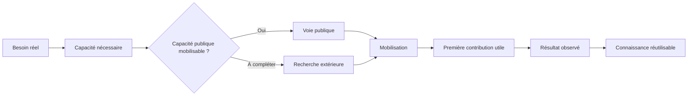
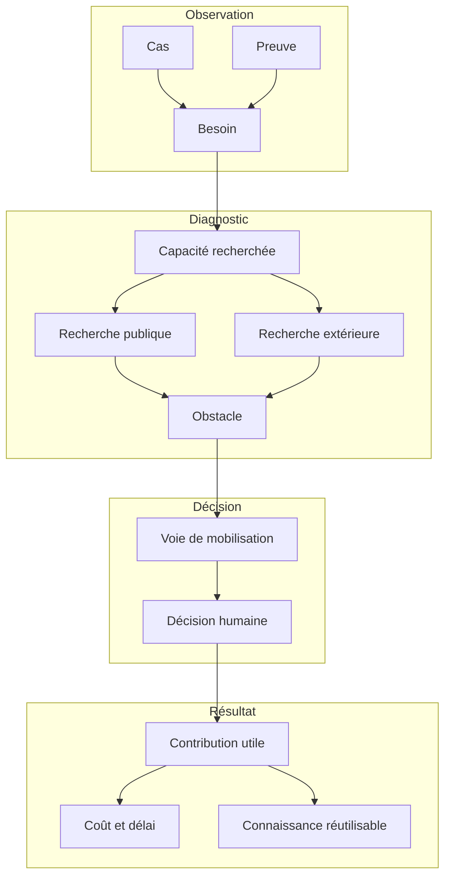

<div align="center">

# FRONTIÈRE

### Institut pour l’intérêt public

**Recherche appliquée sur la mobilisation des capacités scientifiques et techniques pour l’action publique**

[](https://github.com/fraware/frontiere-institut-interet-public/actions/workflows/ci.yml)


</div>

---

FRONTIÈRE étudie une question pratique : **comment une institution publique trouve-t-elle et mobilise-t-elle, au moment utile, la capacité scientifique ou technique nécessaire à une mission précise ?**

Le projet traite chaque situation comme un problème de capacité. La ressource pertinente peut être une personne, une équipe, un laboratoire, un organisme public, un prestataire, une donnée, un outil, une infrastructure ou une procédure. L’objectif consiste à identifier la cause réelle de la difficulté puis la plus petite intervention susceptible de la corriger.

## Chaîne de travail



Les décisions institutionnelles restent humaines. Le logiciel structure les faits, conserve les preuves, rend les changements traçables et permet des comparaisons reproductibles.

## État actuel

| Élément | État |
| --- | ---: |
| Signaux publics structurés | 50 |
| Cas solides vérifiés | 16 |
| Chronologies documentées | 10 |
| Chronologies avec un délai de parcours directement exploitable | 6 |
| Corpus de développement technique | 20 cas publics |
| Cas rétrospectifs structurés | 12 |
| Jeu réservé | 10 |
| Cas prospectifs complets observés | 0 |

<!-- FRONTIERE:ETAT_REFERENTIEL:DEBUT -->
| Couverture institutionnelle | État |
| --- | ---: |
| Enregistrements de l’Annuaire de l’administration couverts | 93 782 / 93 782 |
| Services issus du Référentiel de l’organisation administrative de l’État | 7 905 |
| Services et guichets locaux issus de l’Annuaire | 85 877 |
| Relations hiérarchiques résolues dans l’organisation de l’État | 8 073 |
| Relations hiérarchiques résolues parmi les services locaux | 4 155 |
| Unités territoriales issues du Code officiel géographique 2026 | 40 345 |
| Relations entre unités territoriales | 150 421 |
| Références de l’Annuaire reliées à une unité territoriale actuelle | 305 447 / 305 454 |
| Références territoriales anciennes expliquées par l’historique officiel | 7 / 7 |
<!-- FRONTIERE:ETAT_REFERENTIEL:FIN -->

Les indicateurs empiriques du premier tableau ont pour date de référence le 6 octobre 2026. Le tableau institutionnel est régénéré après chaque cycle complet à partir des fichiers statistiques de référence. Aucun de ces nombres ne constitue une estimation de fréquence à l’échelle de l’administration française.

La principale frontière empirique se situe désormais entre trois explications : difficulté à identifier une ressource, difficulté à la mobiliser et difficulté à transformer sa mobilisation en contribution utile. Le projet entre dans une phase de collecte de données proches de l’exécution.

→ [État détaillé du projet](docs/ETAT_DU_PROJET.md)  
→ [Organisation administrative de l’État : source, couverture et mise à jour](docs/INGESTION_ROAE_V1.md)  
→ [Couverture territoriale de l'Annuaire](docs/INGESTION_ANNUAIRE_LOCAL_V1.md)  
→ [Territoires de référence de l’Insee](docs/INGESTION_COG_V1.md)

## Principes de recherche

FRONTIÈRE suit cinq disciplines.

1. **Partir de cas observables.** Un épisode documenté vaut davantage qu’un intérêt général pour le concept.
2. **Rechercher d’abord les capacités publiques existantes.** Une compétence déjà disponible et mobilisable constitue une solution.
3. **Séparer identification et mobilisation.** Une ressource trouvée devient pertinente seulement si ses conditions réelles de mobilisation sont connues.
4. **Conserver les contre-exemples et les résultats négatifs.** Une solution existante qui fonctionne correctement constitue un résultat utile.
5. **Versionner les décisions et les preuves.** Les définitions, règles et interprétations évoluent de manière explicite et traçable.

## Architecture conceptuelle



→ [Architecture détaillée](docs/ARCHITECTURE.md)

## Repères du dépôt

| Répertoire / fichier | Rôle |
| --- | --- |
| `app/` | Application FastAPI et logique métier |
| `donnees/` | Corpus public, chronologies et données de recherche versionnées |
| `institutionnel/` | Référentiel vivant des institutions, sources, relations et changements |
| `evaluation/` | Jeux de cas, formats de réponses et instruments de comparaison |
| `scripts/` | Initialisation, vérification et évaluation |
| `tests/` | Vérifications automatiques |
| `docs/` | Protocole, architecture, gouvernance, exécution et résultats empiriques |
| `SECURITE.md` | Règles de sécurité pour le dépôt public |

→ [Index complet de la documentation](docs/INDEX.md)

## Documentation essentielle

Pour comprendre le projet dans le bon ordre :

1. [Protocole de recherche](docs/PROTOCOLE_V1.1.md)
2. [Architecture du système](docs/ARCHITECTURE.md)
3. [Modèle de données](docs/MODELE_DONNEES_V0.2.md)
4. [Règles de décision](docs/REGLES_DECISION.md)
5. [État empirique actuel](docs/ETAT_DU_PROJET.md)
6. [Évaluation technique](docs/EVALUATION_TECHNIQUE_V0.5.md)
7. [Reproductibilité](docs/REPRODUCTIBILITE.md)
8. [Plan d’exécution sur douze semaines](docs/PLAN_12_SEMAINES.md)
9. [Référentiel institutionnel vivant](docs/REFERENTIEL_INSTITUTIONNEL_V1.md)
10. [Sécurité et gouvernance](docs/SECURITE_GOUVERNANCE.md)

## Évaluation

L’évaluation compare FRONTIÈRE à des méthodes ordinaires sur les mêmes demandes et avec les mêmes informations de départ.

Les mesures sont conservées séparément : justesse de la voie proposée, justesse de la forme de ressource, ressources concrètes retrouvées, temps total, temps humain de vérification et qualité des preuves.

Le dépôt distingue un corpus de développement d’un jeu réservé. Les références du jeu réservé restent hors du dépôt public ; leur empreinte cryptographique permet de vérifier qu’elles ont été fixées avant les réponses externes.

→ [Méthode d’évaluation](docs/EVALUATION_TECHNIQUE_V0.5.md)  
→ [Cas rétrospectifs de développement](evaluation/CAS_RETROSPECTIFS_DEVELOPPEMENT.md)

## Installation locale

Prérequis : Python 3.11 ou version ultérieure.

```bash
git clone https://github.com/fraware/frontiere-institut-interet-public.git
cd frontiere-institut-interet-public

python -m venv .venv
source .venv/bin/activate
pip install -e ".[dev]"

python scripts/initialiser_demonstration.py
uvicorn app.main:app --reload
```

Sous Windows PowerShell :

```powershell
.venv\Scripts\Activate.ps1
```

Ouvrir ensuite `http://127.0.0.1:8000`.

## Vérifications

```bash
python -m compileall -q app scripts tests
pytest
```

Les mêmes vérifications sont exécutées automatiquement sur les demandes de fusion et sur la branche principale.

## Données et sécurité

Le dépôt est public. Les données confidentielles, les informations de sécurité, les dossiers individuels et les éléments nominativement sensibles appartiennent à un environnement privé adapté.

Les données publiques utilisées comme preuve conservent leur provenance et leur niveau de précision. Une information inconnue reste explicitement inconnue.

→ [Politique de sécurité](SECURITE.md)

## Contribuer

Toute contribution doit améliorer directement l’une des opérations suivantes : comprendre le besoin, identifier une capacité, vérifier une ressource, établir sa mobilisabilité, mesurer un résultat ou réutiliser une connaissance acquise.

→ [Guide de contribution](CONTRIBUTING.md)

## Historique

Les principales évolutions du projet sont consignées dans [CHANGELOG.md](CHANGELOG.md).

## Citation

Les métadonnées de citation sont disponibles dans [CITATION.cff](CITATION.cff). GitHub les expose directement dans l’interface du dépôt.

## Licence

Aucune licence ouverte n’est actuellement déclarée dans ce dépôt. La publication du code source n’accorde pas, à elle seule, un droit général de réutilisation. Une licence explicite devra être choisie avant toute diffusion visant la réutilisation externe.

---

<div align="center">

**FRONTIÈRE — comprendre où se situe réellement le déficit de capacité avant de choisir l’intervention.**

</div>
