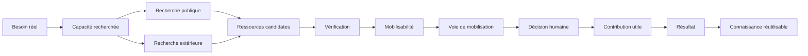
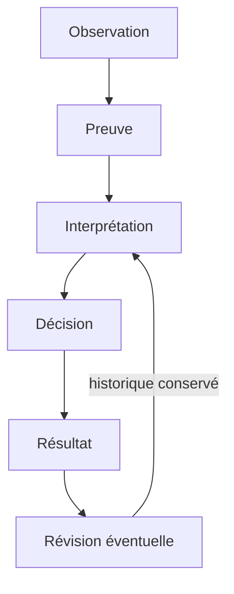

# Architecture de FRONTIÈRE

## Finalité

FRONTIÈRE structure le parcours entre un besoin public réel et une capacité effectivement utilisable. L’architecture sépare volontairement quatre questions : comprendre le besoin, identifier les ressources, déterminer leur mobilisabilité et mesurer le résultat.



## Principe central

Le besoin, la capacité et la ressource sont trois objets différents.

Un besoin décrit le résultat que l’institution cherche à produire.

Une capacité décrit ce qu’il faut savoir faire pour produire ce résultat.

Une ressource décrit ce qui peut apporter cette capacité : personne, équipe, organisme, laboratoire, prestataire, outil, donnée, infrastructure, service ou procédure.

Cette séparation réduit le risque de traduire automatiquement tout besoin en recrutement individuel.

## Parcours d’un cas

### 1. État initial

Le cas enregistre l’institution, le résultat recherché, la capacité nécessaire, la chronologie connue, les démarches déjà entreprises, la situation actuelle et ce qui se serait vraisemblablement produit en l’absence de FRONTIÈRE.

L’état initial est conservé avant toute recommandation afin de limiter la reconstruction a posteriori.

### 2. Recherche publique

La première recherche porte sur les ressources déjà présentes dans le secteur public.

Les résultats distinguent une recherche insuffisante, une capacité publique mobilisable, une capacité publique pertinente mais difficile à mobiliser et l’absence de ressource publique pertinente identifiée.

### 3. Recherche complémentaire

Une recherche extérieure intervient lorsque le cas le justifie. La ressource traverse plusieurs degrés : identification, pertinence plausible, capacité vérifiée, conditions compatibles, engagement confirmé, puis mobilisabilité pour le besoin précis.

### 4. Voie de mobilisation

La voie décrit le mécanisme permettant à la ressource de contribuer. Elle peut relever d’une mobilité publique, d’un recrutement, d’une mission temporaire, d’une prestation, d’un organisme public existant, d’une formation ou d’un investissement matériel.

### 5. Décision

Le système conserve les faits et les comparaisons. Les décisions qui engagent une institution ou une personne restent humaines.

### 6. Résultat

Le résultat est évalué selon plusieurs dimensions distinctes : effet sur le besoin, délai, qualité, coût et apprentissage réutilisable.

## Décomposition temporelle

La chronologie cible quatre points principaux :

```text
besoin → ressource identifiée → ressource mobilisée → première contribution utile
```

Cette décomposition distingue un problème de recherche d’un problème de mobilisation ou d’intégration.

Les étapes parallèles sont représentées comme telles. Une somme naïve de tous les délais administratifs produirait une mesure trompeuse.

## Traçabilité



Une révision substantielle conserve l’ancienne valeur, la nouvelle valeur, la justification et les éléments disponibles au moment du changement.

## Évaluation

L’évaluation technique compare plusieurs méthodes avec les mêmes informations de départ. Les références réservées restent séparées des réponses produites.

Les mesures sont conservées séparément afin d’éviter qu’une bonne performance sur une dimension masque une faiblesse sur une autre.

## Frontière de sécurité

Le dépôt public traite uniquement des informations adaptées à une publication ouverte.

Les données personnelles sensibles, informations de sécurité, conflits d’intérêts détaillés et dossiers individuels appartiennent à un environnement privé distinct. L’architecture publique sert à définir les objets et les règles ; elle ne constitue pas un environnement de traitement de données restreintes.

## Structure logicielle

| Répertoire | Responsabilité |
| --- | --- |
| `app/` | Interface et logique applicative |
| `donnees/` | Observations et analyses empiriques versionnées |
| `evaluation/` | Cas et formats destinés aux comparaisons |
| `scripts/` | Initialisation, vérification et évaluation |
| `tests/` | Contrôles automatisés |
| `docs/` | Méthode, gouvernance, résultats et exécution |

Le détail des objets persistés figure dans [MODELE_DONNEES_V0.2.md](MODELE_DONNEES_V0.2.md).
